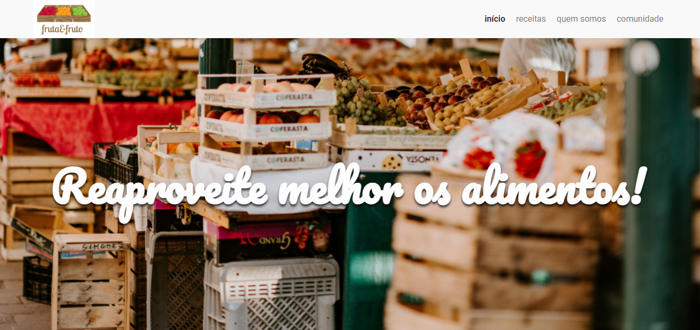

# Fruta & Fruto

### Projeto desenvolvido para o curso de *Arquitetura CSS: Descomplicando os problemas* do instrutor Matheus Castiglioni.

&nbsp;

Nesse projeto desenvolvemos o site responsivo de receitas Fruta & Fruto. 
Para o desenvolvimento do site utilizamos algumas boas práticas de CSS, como a metodologia *Atomic Design*, com a qual organizamos e arquitetamos nosso projeto de maneira mais eficiente e de fácil manutenção.

&nbsp;

Clique na imagem para visualizar o site:

